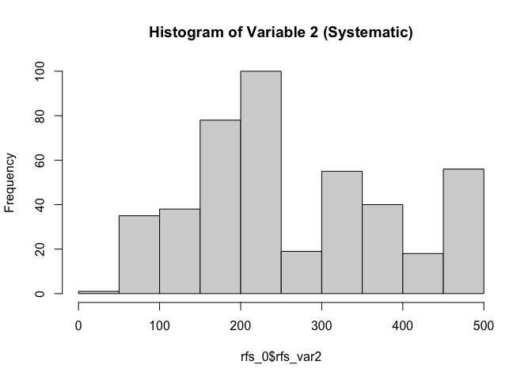

APS Aim 7 Derived Variables Summary
================

## Neuromuscular Blockade

| Value | Counts | % of Data |
|:------|-------:|:----------|
| 0     |   8171 | 99.79%    |
| 1     |     17 | 0.21%     |

## Inflammatory Profile (Streamlined)

| Value | Counts | % of Data |
|:------|-------:|:----------|
| 0     |   8159 | 99.65%    |
| 1     |     29 | 0.35%     |

## Respiratory Failure Severity (Systematic)

### Variable 1

| Value | Counts | % of Data |
|:------|-------:|:----------|
| 0     |   7759 | 94.76%    |
| 1     |     98 | 1.2%      |
| 2     |    103 | 1.26%     |
| 3     |     30 | 0.37%     |
| 4     |    179 | 2.19%     |
| 5     |     19 | 0.23%     |

### Variable 2

<!-- -->
